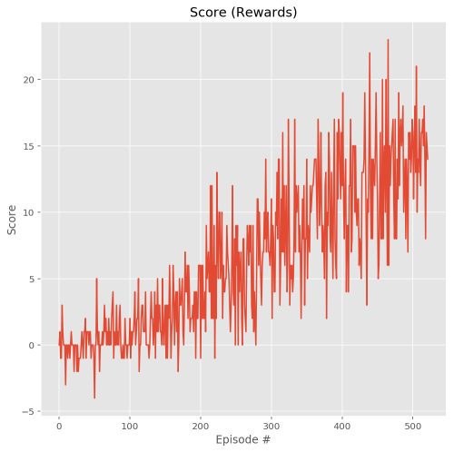

[//]: # "Image References"

[image1]: https://user-images.githubusercontent.com/10624937/42135619-d90f2f28-7d12-11e8-8823-82b970a54d7e.gif "Trained Agent"

# ML Unity Banana Collector

### Introduction

In this project we will train an RL agent using [DQN](https://pytorch.org/tutorials/intermediate/reinforcement_q_learning.html) algorithm to collect yellow bananas in the Unity Banana environment. The project is implemented using PyTorch.

![Trained Agent][image1]


## Environment/Action Description:

 - Collect yellow banana: +1 reward
 - Collect blue banana: -1 reward
 - Actions: move forward, move backward, turn left, turn right
 - State space dimension (observation): 37 states including agents velocity, etc

To solve the environment, the agent must get an average score of +13 over 100 consecutive episodes (this can be modified in the code).
For more details on the environment see the following page:
[Udacity DeepRL nano degree/Navigation project](https://github.com/udacity/deep-reinforcement-learning/tree/master/p1_navigation)

## Requirements and Dependencies
1. The Unity bananas environment for Windows (64-bit) is included in this repo. For other OS please see the following link: [Unity Banana Environment Dowlnoad](https://github.com/udacity/deep-reinforcement-learning/tree/master/p1_navigation#getting-started)
    **Note:** make sure `AHF_Banana.py` has access to `Banana.exe` (they are in the same folder).
2. It is highly recommended to create a conda virtual environment and install the dependencies and requirements there:
```bash
conda create --name DRL python=3.6 
activate DRL
```
3. Clone the repository, and navigate to the `python/` folder.  Then, install several dependencies.
```bash
git clone https://github.com/udacity/deep-reinforcement-learning.git
cd deep-reinforcement-learning/python
pip install .
```
**Note:** if you face issues installing PyTorch using the above method, you can remove `torch==0.4.0` from the `python/requirements.txt` file and instal PyTorch using conda using `conda install pytorch=0.4.0 -c pytorch` ([more details](https://github.com/udacity/deep-reinforcement-learning/issues/13#issuecomment-475455429)).

## Instructions

The main file is `AHF_Banana.py` that initializes the Unity banana environment, opens the DQN agent and starts training using given parameters. To train the agents just run `AHF_Banana.py` with the conda virtual env activated.
The DQN agent is defined in `AHF_DQN.py` where you can modify batch-size, learning rate, etc.
The NN model is defined in `AHF_model.py` where you can modify number of hidden layers, units, activation functions, etc.


### Summary of the Q-network
The layers of the Q-network used in the DQN agent is shown here. You can modify the number of layers, hidden units, activation functions, dropout layers, etc to see the change in the performance. 

```
  (fc1): Linear(in_features=37, out_features=1024, bias=True)
  (fc2): Linear(in_features=1024, out_features=512, bias=True)
  (fc3): Linear(in_features=512, out_features=256, bias=True)
  (fc4): Linear(in_features=256, out_features=4, bias=True)
```
Note that the number of `in-features` of the 1st layer should be equal to the state-space dimension of the environment which is 37. Moreover, the `out_features` of the last layer should be equal to the action-space dimension which is 4.


## Results
Running `AHF_Banana.py` on cpu I got the following results:
```
Episode 100     Average Score: 0.242
Episode 200     Average Score: 2.13
Episode 300     Average Score: 5.73
Episode 400     Average Score: 9.67
Episode 500     Average Score: 12.25
Episode 522     Average Score: 13.01
Environment solved in 422 episodes!     Average Score: 13.01

Total Training time = 41.1 min
```
As mentioned above the environment is considered solved when the agent achieves Average Score >= 13.01 in 100 consecutive Episodes.

Here is a plot of the Score vs Episodes of training




